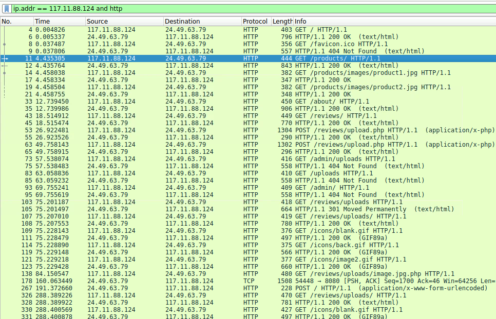
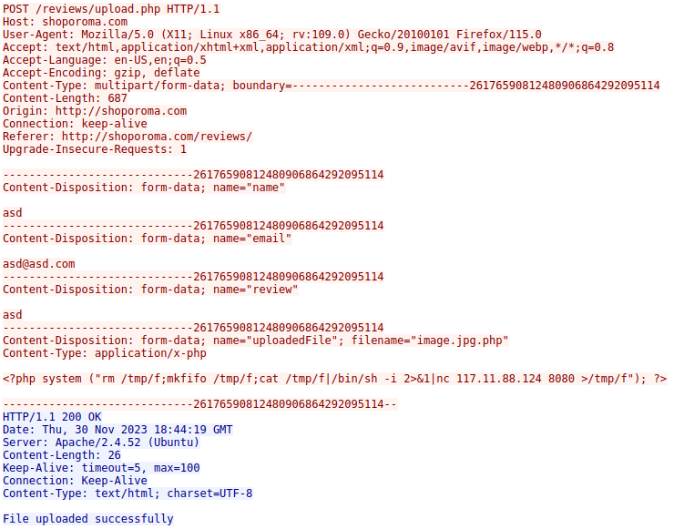
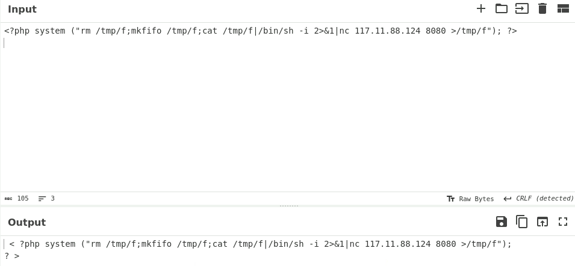
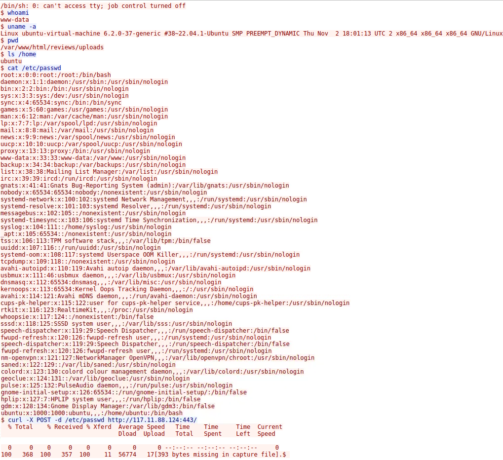

# Análisis Forense de Red - Caso PCAP-01

## 1. Contexto y Escenario
El informe analiza una captura de tráfico .pcap con Wireshark tras detectarse actividad sospechosa en un servidor web de producción. El objetivo es reconstruir la línea de tiempo del ataque, identificar el método de infiltración y verificando si hubo robo de información.

## 2. Resumen de Hallazgos
Tras auditar la captura de red .pcap confirmo que el servidor fue comprometido. El atacante logró saltarse los filtros de subida con un bypass de doble extensión y exfiltró el archivo `/etc/passwd`. 

**Puntos clave:**
* **Acceso:** Exitoso mediante WebShell.
* **Escalada de privilegios:** **No detectada.** El atacante operó siempre como `www-data`.
* **Movimiento lateral (Pivoting):** **No detectado.** El ataque se mantuvo aislado en el servidor web.

## 3. Datos del Incidente
* **Analista:** [zehodotcom](https://github.com/zehodotcom)
* **Gravedad:** **Crítica** (Exfiltración de datos sensibles confirmada).
* **IP Origen:** `117.11.88.124` (Localizada en China).
* **Reputación:** Tras consultar en **AbuseIPDB**, la dirección cuenta con múltiples reportes previos por escaneo de puertos y actividades maliciosas.
* **Huella Digital (User-Agent):** `Mozilla/5.0 (X11; Linux x86_64; rv:109.0) Gecko/20100101 Firefox/115.0`
El registro identifica el uso del navegador Firefox 115 sobre una plataforma Linux, suponiendo que no se ha empleado User-Agent Spoofing para falsear este dato

## 4. Análisis Técnico Detallado

### 4.1 Reconocimiento y Fuzzing
**Filtro Wireshark:** `ip.addr == 117.11.88.124 && http`
El atacante comenzó con un escaneo agresivo buscando directorios expuestos. Se detectaron ráfagas de errores 404 seguidas de peticiones exitosas hacia `/reviews/`.

### 4.2 El Bypass de Seguridad (Explotación)
**Filtro Wireshark:** `http.request.method == "POST" && ip.src == 117.11.88.124`
El atacante intentó subir un archivo `.php` malicioso, pero el servidor lo rechazó ("invalid file format"). Inmediatamente, cambió la táctica a un **bypass de doble extensión** utilizando `image.jpg.php`. 

El servidor validó el archivo basándose en la extensión `.jpg`, permitiendo su subida y posterior ejecución por el motor de PHP.

#### Análisis del Artefacto (CyberChef)
Extraje el código del payload y usé **CyberChef** para limpiarlo. Es una *reverse shell* que utiliza `mkfifo` para crear comunicación bidireccional conectada al puerto 8080 del atacante.

### 4.3 Post-Explotación y Robo de Datos
**Filtro Wireshark:** `tcp.port == 8080`
Una vez establecida la shell interactiva, el flujo TCP muestra al atacante ejecutando comandos de reconocimiento:
1.  `whoami`: Confirmó privilegios bajos (`www-data`).
2.  `uname -a` y `pwd`: Identificación del sistema y rutas.
3.  **Exfiltración:** Se utilizó `curl` para enviar el contenido de `/etc/passwd` mediante una petición HTTP POST al puerto 443 de la IP atacante.

## 5. Mapeo MITRE ATT&CK
| Táctica | Técnica | ID |
| :--- | :--- | :--- |
| **Initial Access** | Exploit Public-Facing Application | T1190 |
| **Persistence** | Web Shell | T1505.003 |
| **Execution** | Command and Scripting Interpreter | T1059.004 |
| **Discovery** | System Owner/User Discovery | T1033 |
| **Exfiltration** | Exfiltration Over C2 Channel | T1041 |

## 6. Indicadores de Compromiso (IoCs)
* **IP Atacante:** `117.11.88.124`
* **Archivo Malicioso:** `image.jpg.php`
* **Puertos C2:** 8080 (Shell), 443 (Exfiltración)
* **Herramientas utilizadas:** `curl`, `nc`, `mkfifo`, `sh`

## 7. Recomendaciones de Bastionado (Hardening)
Para evitar que este vector de ataque se repita, las medidas de mitigación propuestas son:
1.  **Validación de firmas (Magic Bytes):** No confiar en la extensión del archivo. Validar el contenido real.
2.  **Egress Filtering:** Bloquear conexiones salientes desde el servidor web hacia puertos no estándar (en especial el 8080).
3.  **Restricción de Binarios:** Limitar el uso de `curl` y `nc` para el usuario de servicio web.
4.  **No-Exec:** Montar la carpeta de subidas con permisos `noexec` para impedir la ejecución de scripts.
5.  **Deshabilitar funciones peligrosas en PHP:** Configurar `disable_functions` en el `php.ini` para bloquear funciones como `exec()`, `shell_exec()`, `system()` y `passthru()`. Esto habría anulado la WebShell aunque el atacante hubiera logrado subirla.
6.  **Centralización de Logs y Alertas:** Implementar alertas ante la ejecución de procesos inusuales por parte del usuario `www-data` (como `nc` o `mkfifo`), para una respuesta más rápida en el futuro.

## 8. Notas Finales
Este análisis ha sido realizado como parte de un desafío de entrenamiento en una plataforma de Blue Team (CTF/Lab). El objetivo es demostrar habilidades de análisis de tráfico, identificación de amenazas y documentación técnica.
* **Herramientas utilizadas:** Wireshark, CyberChef, AbuseIPDB.